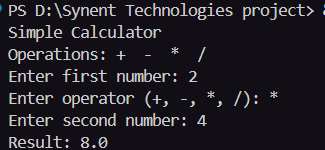

# 🧮 Simple CLI Calculator

A simple Command Line Calculator built using Python.  
This project performs basic arithmetic operations and includes error handling for invalid inputs and division by zero.

---

## 📌 Features

✔ Addition  
✔ Subtraction  
✔ Multiplication  
✔ Division  
✔ User Input Handling  
✔ Error Handling  
✔ Division by Zero Protection  

---

## 🚀 Technologies Used

- Python 3

---

## 📂 Project Structure

```bash
simple-cli-calculator/
│
├── calculator.py
└── README.md
▶ How to Run the Project
1️⃣ Clone the Repository
git clone https://github.com/your-username/simple-cli-calculator.git
2️⃣ Navigate to the Project Folder
cd simple-cli-calculator
3️⃣ Run the Program
python calculator.py
💻 Program Code
# Simple CLI Calculator

print("Simple Calculator")
print("Operations: +  -  *  /")

try:
    # Take user input
    num1 = float(input("Enter first number: "))
    operator = input("Enter operator (+, -, *, /): ")
    num2 = float(input("Enter second number: "))

    # Perform calculation
    if operator == "+":
        result = num1 + num2

    elif operator == "-":
        result = num1 - num2

    elif operator == "*":
        result = num1 * num2

    elif operator == "/":
        if num2 == 0:
            print("Error: Division by zero is not allowed.")
        else:
            result = num1 / num2
            print("Result:", result)

    else:
        print("Invalid operator!")

    # Display result for other operations
    if operator in ["+", "-", "*"]:
        print("Result:", result)

# Handle invalid number input
except ValueError:
    print("Invalid input! Please enter numeric values.")
📸 Example Output
Simple Calculator
Operations: +  -  *  /

Enter first number: 20
Enter operator (+, -, *, /): +
Enter second number: 10

Result: 30.0
⚠ Error Handling

The program handles:

Invalid numeric inputs
Invalid operators
Division by zero

Example:

Error: Division by zero is not allowed.
📚 Concepts Used
Variables
Data Types
User Input
Conditional Statements
Exception Handling
Arithmetic Operations

## 📸 Project Screenshot


